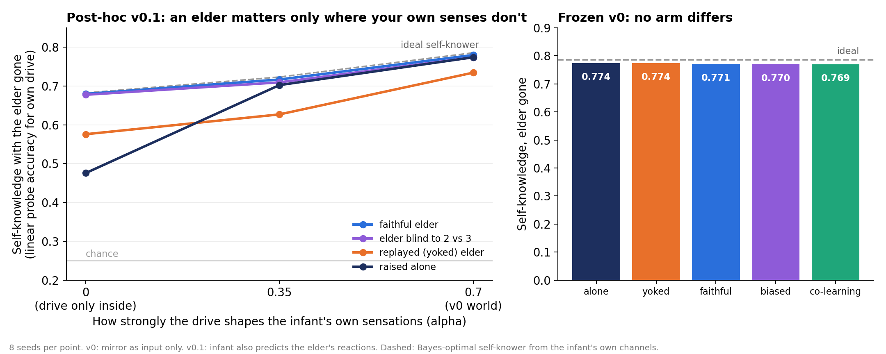

# LinkitetytSekvenssiOppijat

*Linked sequence learners.* Can a learner come to know its own inner state because another
learner mirrors it, and keep that knowledge after the other is gone?

**Status:** frozen v0 **failed every hypothesis**. A post-hoc v0.1, designed after that result
and pre-registered before it ran, found the condition under which the idea holds.



## The idea being tested

If people are sequence learners, what happens when two of them are coupled? One version: part of
the inner being is learned from others. The social-biofeedback theory (Gergely & Watson 1996)
says infants learn to recognise their own emotional states through a caregiver's contingent
mirroring. Murray & Trevarthen's double-video studies, replicated by Nadel et al. (1999), showed
that two-month-olds treat a live mother and a replay of the same mother differently.

This repository builds the smallest machine version of both.

## What was built

One hidden **drive** d ∈ {0,1,2,3} (a mood) changes slowly inside an infant. It shapes three
channels:

| channel | who sees it | strength |
|---|---|---|
| the infant's own sensation stream (tokens whose transitions depend on d) | infant | set by alpha |
| interoception | infant only | weak |
| face | elder only | clear |

You cannot see your own face; the other cannot feel your insides.

The **infant** is a GRU that learns only from its own prediction errors. The **elder** reads the
face and shows the infant what it sees. No gradient ever crosses between them (unit-tested).
Self-knowledge is measured with the elder gone, by a linear probe for the drive on the infant's
hidden state. The ideal self-knower is a Bayes filter on the infant's own channels.

| arm | what the elder shows |
|---|---|
| ALONE | nothing |
| YOKED | the faithful elder's display for a *different* infant: same statistics, not contingent |
| FAITHFUL | the ideal reading of this infant's face |
| BIASED | as faithful, but blind to the difference between drives 2 and 3 |
| COLEARN (v0 only) | an elder GRU learning at the same time, from its own errors only |

The world was tuned only against ideal observers (`docs/CALIBRATION.md`). Predictions were
committed before any learner code existed (`PREDICTIONS.md`). Seeds: 3, 17, 29, 41, 59, 73, 97, 113.

## Frozen v0: the mirror as input — nothing

In v0, the drive shapes the infant's own sensations strongly (alpha 0.7). The elder's display is
shown on half the episodes, and the infant uses it as input.

| arm | self-knowledge, elder gone |
|---|---:|
| ALONE | 0.774 |
| YOKED | 0.774 |
| FAITHFUL | 0.771 |
| BIASED | 0.770 |
| COLEARN | 0.769 |
| ideal self-knower | 0.785 |

| gate | result |
|---|---|
| G0 setup works (mirror read when on: 0.926) | pass |
| H1 mirror becomes inner (faithful − alone ≥ +0.03) | **fail**: −0.003, 0/8 seeds positive |
| H2 blind spot inherited | **fail**: −0.001 |
| H3 mirror teaches reading interoception | **fail**: +0.007 (6/8 positive, needed +0.02) |
| H4 a co-learning elder is enough | **fail**: −0.004, 0/8 |
| H5 mirror speeds development | **fail, reversed**: −0.006 at 500 steps |

Infants raised alone reached 98.5 % of the ideal. Their own prediction task already required
knowing the drive, so the mirror had nothing to teach. It was a small crutch: mirror arms were
slightly behind at every checkpoint (at 250 steps, faithful 0.691 vs alone 0.707).

My design error: I calibrated the "room to learn" against the ideal observer, not against what a
learner reaches on its own.

## Post-hoc v0.1: predicting how the elder reacts — the line appears

`POSTHOC.md` was written after v0's result and committed before any v0.1 run. Two changes:

1. The elder reacts in brief glances (probability 0.15 per step), and the infant must **predict its
   next reaction**, not only receive it.
2. The drive's effect on the infant's own sensations is swept: alpha 0, 0.35, 0.7.

| alpha | alone | yoked | faithful | biased | ideal |
|---|---:|---:|---:|---:|---:|
| 0 (drive only inside) | 0.476 | 0.576 | **0.680** | 0.677 | 0.682 |
| 0.35 | 0.702 | 0.627 | 0.717 | 0.709 | 0.723 |
| 0.7 (v0's world) | 0.774 | 0.734 | 0.780 | 0.774 | 0.785 |

| prediction | result |
|---|---|
| PH1 at alpha 0, faithful − alone ≥ +0.05; at 0.7, under 0.02 | **pass**: +0.204 (8/8) → +0.006 |
| PH2 contingency: faithful − yoked ≥ +0.05 **and** yoked ≈ alone | **fail**: faithful beats yoked by +0.104 (8/8), but yoked also beats alone by +0.100 |
| PH3 blind spot inherited at alpha 0 (≥ +0.05 on drive 2 vs 3) | **fail**: +0.002 |
| PH4 the benefit shrinks steadily with alpha | **pass**: +0.204, +0.014, +0.006 |

What the post-hoc shows:

- **You learn alone what your own predictions need.** Where the drive shapes the infant's own
  senses, a partner adds almost nothing lasting.
- **You learn from others what only others react to.** When the drive touches only the insides and
  the face, an infant raised alone barely knows it (0.476). An infant that had to predict a
  faithful elder's reactions knows it to the ideal (0.680 of 0.682), and keeps knowing it with the
  elder gone. It learned to read its own interoception, because that was the only way to
  anticipate the elder.
- **Contingency matters, but not only contingency.** A replayed elder gives half the benefit where
  the state is invisible to the infant's own senses. Where the infant would learn the state anyway,
  it **hurts** (−0.075 at 0.35, −0.040 at 0.7; 0/8 seeds positive). One untested explanation:
  predicting any slow signal lengthens the infant's memory, which also integrates interoception
  longer.
- **The elder's blind spot mostly did not pass on.** At alpha 0 the biased elder's infant tells 2
  from 3 as well as the faithful one's. A small, specific deficit appears at 0.35 and 0.7 (+0.011,
  +0.009 on 2 vs 3, 8/8; the 0-vs-1 control is unchanged). This world makes that test weak: each
  drive has its own interoceptive channel, so telling 2 from 3 costs nothing once the infant
  listens at all. The elder taught the infant to *listen inward*; it could not teach it *which
  categories to use*, because the categories were already in the inputs.

**For the coupled-learners idea:** in this machine, "part of the inner being comes from coupling"
holds for exactly the part of you that only others' reactions make worth knowing. It holds only
if you learn by predicting how others respond to you, not by just receiving what they show.

## How this fixes CoupledSequenceLearners v0

| problem in that v0 | here |
|---|---|
| the score averaged both learners' guesses, which pools their private information for free | only the infant's own hidden state is scored |
| the yoked arm froze only one side's outgoing messages | the elder's whole signal, timing and content, comes from another episode |
| one optimizer trained both learners through the channel | the infant learns only from its own errors; no gradient reaches any elder |

## Ledger: limits and what is not new

- **Post-hoc, not confirmatory.** v0.1 was designed after v0 failed. Its predictions were committed
  first, but it should be repeated on fresh seeds before anyone relies on it.
- **The elder is an ideal observer**, except in v0's co-learning arm. Only the infant learns in
  v0.1. A two-way version, where the elder also learns from the infant's reactions, is untested.
- **Tiny world**: 4 drives, 6 tokens, 64 steps, 32-unit GRUs, 2000 steps, 8 seeds.
- **Linear probe**: it measures what is readable from the infant's state, not what the infant uses.
- **At alpha 0 the main effect is partly built in**: predicting the elder is the only reason to know
  the drive. The non-trivial parts are that it lasts with the elder gone, the yoked results, and
  where the line falls as alpha grows.
- **Not new**: social biofeedback (Gergely & Watson 1996); contingency in infancy (Murray &
  Trevarthen 1985; Nadel et al. 1999); auxiliary prediction tasks shaping representations
  (Jaderberg et al. 2016). What is specific here is the measured line: partner-dependence as a
  function of how much the state matters for one's own predictions, and the harm from a replayed
  partner.
- **Next, if continued**: an inner signal where telling 2 from 3 needs learned combination, to give
  the blind spot a fair test; and an elder that learns back.

## Run it

```
pip install numpy torch matplotlib pytest
python -m pytest -q                  # 10 tests
python scripts/calibrate_world.py    # ideal observers
python scripts/run_frozen.py         # v0, ~25 min on 2 cores
python scripts/summarize.py
python scripts/run_posthoc.py        # v0.1, ~50 min on 2 cores
python scripts/summarize_posthoc.py
python scripts/make_figure.py
```

## Layout

```
PREDICTIONS.md          frozen v0 predictions and ledger
POSTHOC.md              v0.1 design and predictions (written after v0, before v0.1 ran)
docs/CALIBRATION.md     how the world was tuned, ideal observers only
docs/EXPERIMENT_LOG.md  chronological log, including the pilot smoke run
lso/world.py            the world, the ideal observers, faithful and biased elders
lso/agents.py           infant and co-learning elder
lso/experiment.py       v0 development, test, probes
lso/social.py           v0.1 social-prediction infant
scripts/                runners, mechanical summarizers, figure
results/                receipts per seed and arm, summaries, figure
```

## References

- Gergely G, Watson JS (1996). The social biofeedback theory of parental affect-mirroring. *Int J Psychoanal* 77:1181–1212.
- Murray L, Trevarthen C (1985). Emotional regulation of interactions between two-month-olds and their mothers. In Field & Fox (eds.), *Social Perception in Infants*.
- Nadel J, Carchon I, Kervella C, Marcelli D, Réserbat-Plantey D (1999). Expectancies for social contingency in 2-month-olds. *Developmental Science* 2:164–173.
- Jaderberg M, et al. (2016). Reinforcement learning with unsupervised auxiliary tasks. arXiv:1611.05397.
- Hu H, Lerer A, Peysakhovich A, Foerster J (2020). "Other-Play" for zero-shot coordination. *ICML*.
